

# EFAK (原名 Kafka Eagle)

`EAFK` 是一个开源的 Kafka 集群管理和监控工具，旨在帮助用户更好地管理和监控其 Kafka 集群。

## 功能特点

- **实时监控：** 实时监控 Kafka 集群的状态、健康状况以及性能指标。
- **消费者组管理：** 查看和管理消费者组、消费者、消费者偏移等信息。
- **Topic 管理：** 创建、修改、删除 Kafka Topic，并查看 Topic 详细信息。
- **告警系统：** 支持配置告警规则，及时发现集群问题并通知管理员。
- **图表和报表：** 提供可视化的图表和报表，帮助用户更好地理解集群情况。
- **用户权限：** 支持多用户和角色权限管理，确保安全性。
- **易于部署：** 提供简单的安装和部署流程，适用于各种规模的 Kafka 集群。
- **跨平台：** 支持 Linux、Windows、Mac OS X 等多种平台。
- **跨版本：** 支持 Kafka KRaft 模式。

## 快速开始
- [官网地址](https://www.kafka-eagle.org/)
- [用户手册](https://docs.kafka-eagle.org/)

## 系统截图
### 1.集群管理
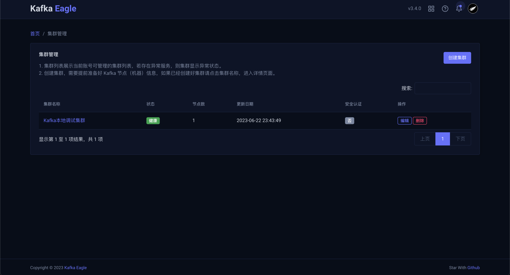

### 2.创建集群
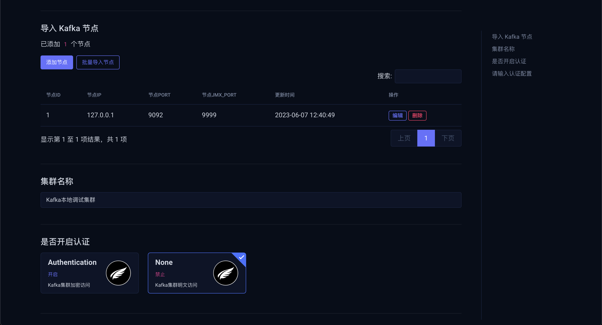

### 3.主题管理
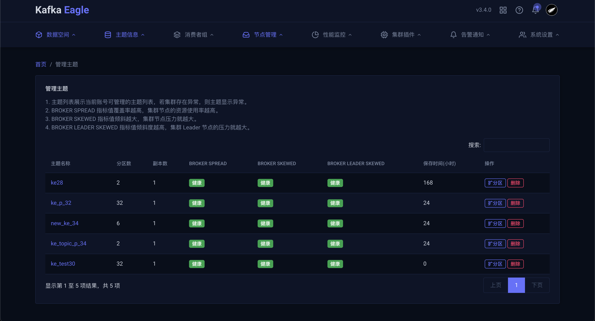

### 4.消费详情
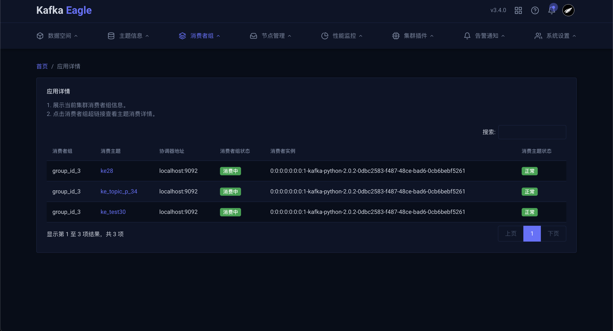

### 5.消费者组
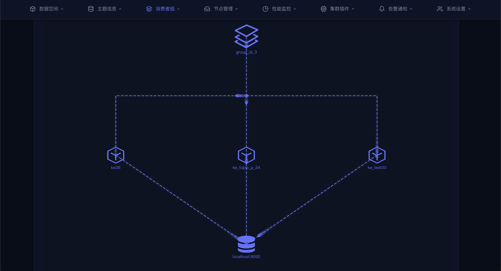

### 6.集群信息
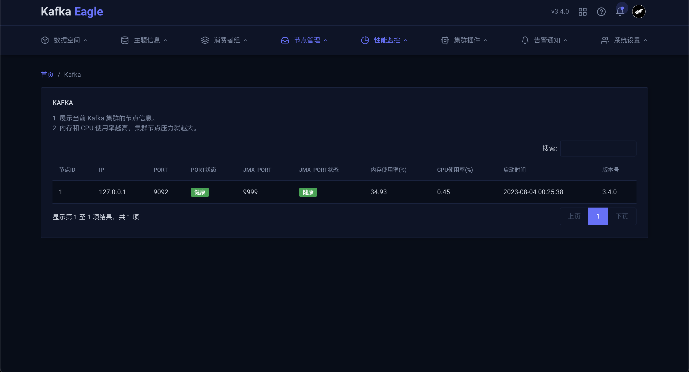

### 7.主题量级
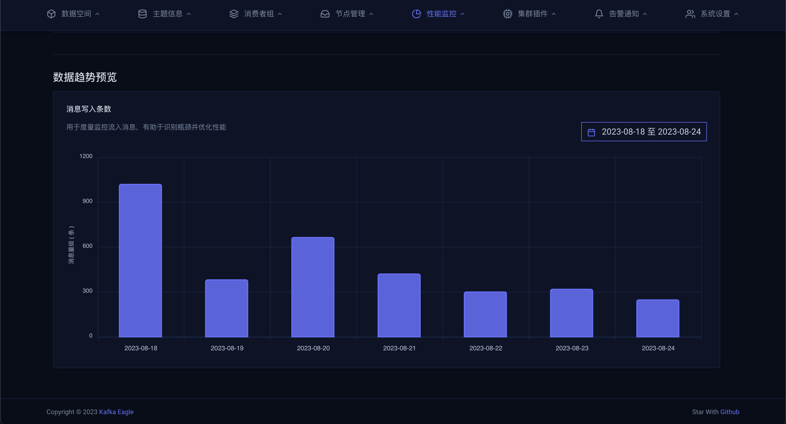

### 8.告警设置
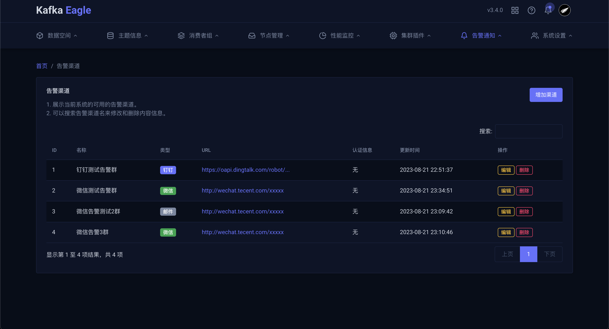

### 9.用户管理
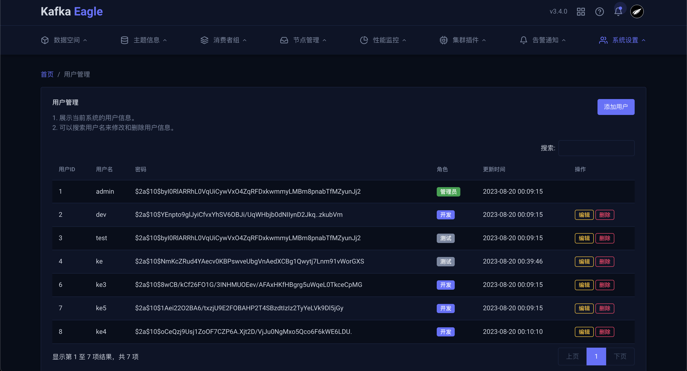

### 10.审计日志
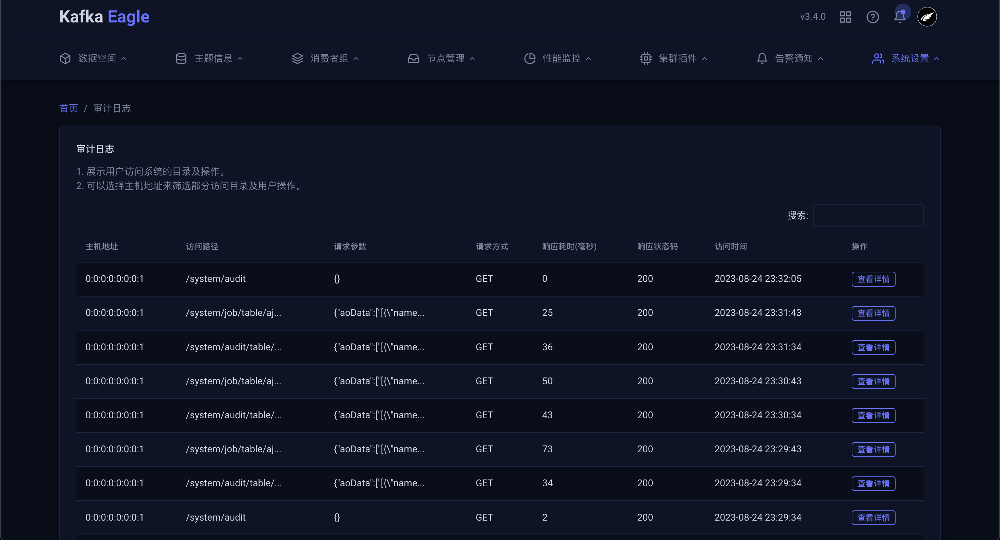

### 11.数据空间
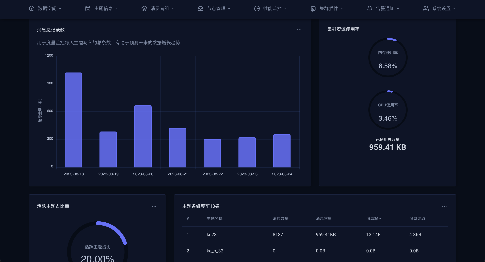

# 贡献代码

`EFAK` 在 Apache 许可证下发布，我们欢迎在此许可证范围内的任何贡献。欢迎提交任何拉取请求，我们将尽快进行审查和合并。
由于这是一个开源工具，请遵守相关法律法规，文明使用。

# 贡献者

感谢以下成员维护该项目。如果这个项目帮助您减少了开发时间，您可以给我们一个星星。

|Alias |Github |Email |
|:-- |:-- |:-- |
|smartloli|[smartloli](https://github.com/smartloli)|smartloli.org@gmail.com|
|hexiang|[hexian55](https://github.com/hexian55)|hexiang55@gmail.com|
|cocodroid|[cocodroid](https://github.com/cocodroid)|sujunguang@gmail.com|
|alisa|[alisa](https://github.com/zoumm)|alisazou1211@gmail.com|
|iamwzt|[iamwzt](https://github.com/iamwzt)|981911861@qq.com|
|JacobAP|[JacobAP](https://github.com/JacobAP)|jacobap@163.com|

--
© 2023 [Kafka Eagle](https://www.kafka-eagle.org/)
