# EFAK-AI 功能预览

本文档展示 EFAK-AI (Eagle For Apache Kafka - AI Enhanced) 系统的核心功能界面和特性。

---

## 目录

- [快速启动](#快速启动)
- [核心功能](#核心功能)
  - [仪表盘](#1-仪表盘-dashboard)
  - [集群管理](#2-集群管理-cluster)
  - [主题管理](#3-主题管理-topics)
  - [主题详情](#4-主题详情-topic-detail)
  - [消费者监控](#5-消费者监控-consumer)
  - [AI 智能对话](#6-ai-智能对话-ai-chat)
  - [模型配置](#7-模型配置-model)
  - [性能监控](#8-性能监控-performance)
  - [告警管理](#9-告警管理-alert)
  - [任务调度](#10-任务调度-task)
  - [用户管理](#11-用户管理-users)
  - [多集群管理](#12-多集群管理-manager)

---

## 快速启动

### 1. 使用快速启动脚本

EFAK-AI 提供了一键启动脚本 `quick-start.sh`，支持多种部署方式：

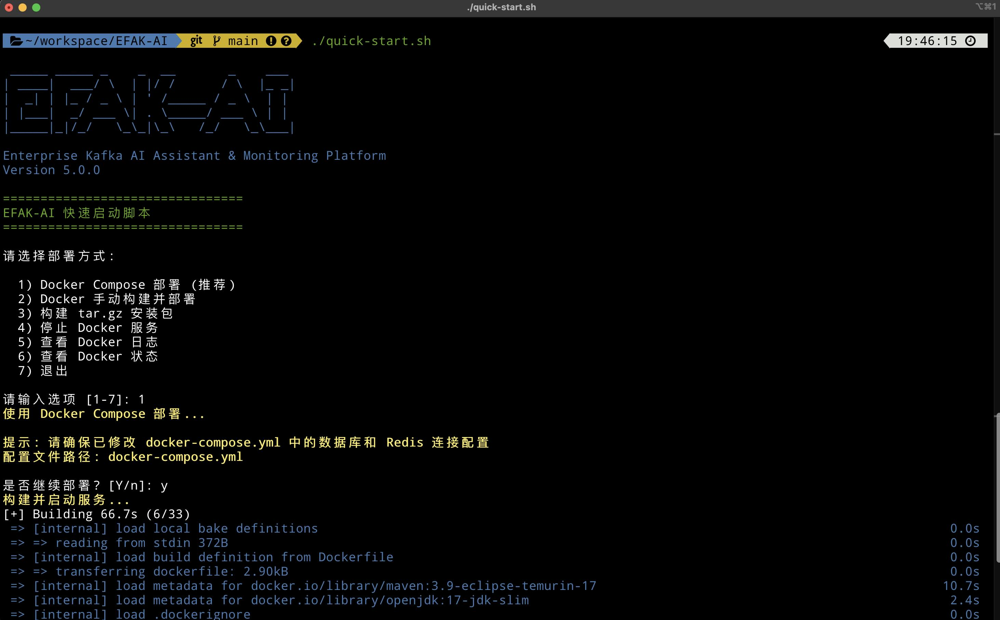

**功能选项：**
- **选项 1**: Docker Compose 部署（推荐）
- **选项 2**: Docker 手动构建并部署
- **选项 3**: 构建 tar.gz 安装包
- **选项 4**: 停止 Docker 服务
- **选项 5**: 查看 Docker 日志
- **选项 6**: 查看 Docker 状态
- **选项 7**: 退出

### 2. 部署成功示例

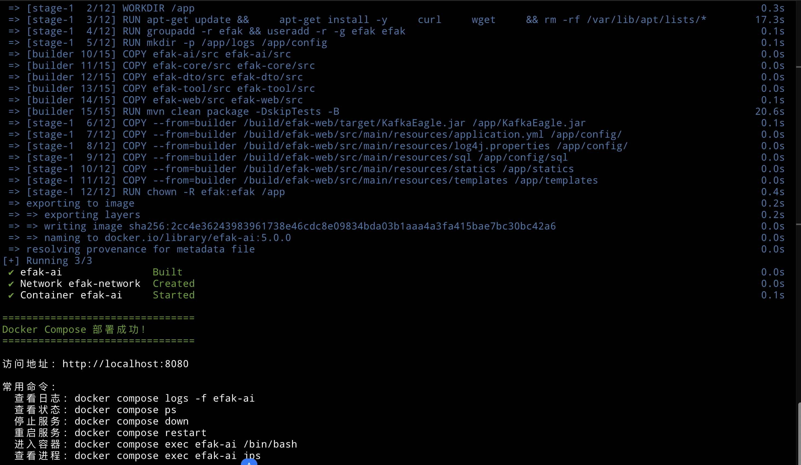

部署成功后，您可以：
- 访问应用: `http://localhost:8080`
- 查看日志: `docker compose logs -f efak-ai`
- 查看状态: `docker compose ps`
- 查看进程: `docker compose exec efak-ai jps`

---

## 核心功能

### 1. 仪表盘 (Dashboard)

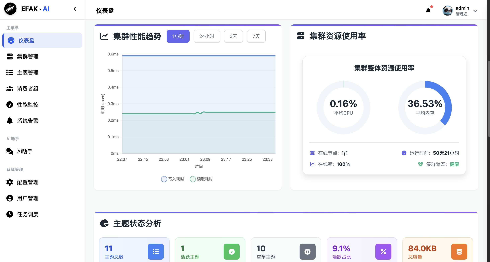

**功能特性：**
- 实时监控: Kafka 集群整体运行状态
- 可视化图表: 消息流量、Topic 数量、Consumer 组状态
- 性能指标: 吞吐量、延迟、存储使用情况
- 告警统计: 实时告警数量和类型分布
- 响应式设计: 支持桌面和移动端访问

**关键指标：**
- Broker 数量和状态
- Topic 总数和活跃数
- Consumer Group 数量
- 消息总量和增长趋势
- 集群健康度评分

---

### 2. 集群管理 (Cluster)

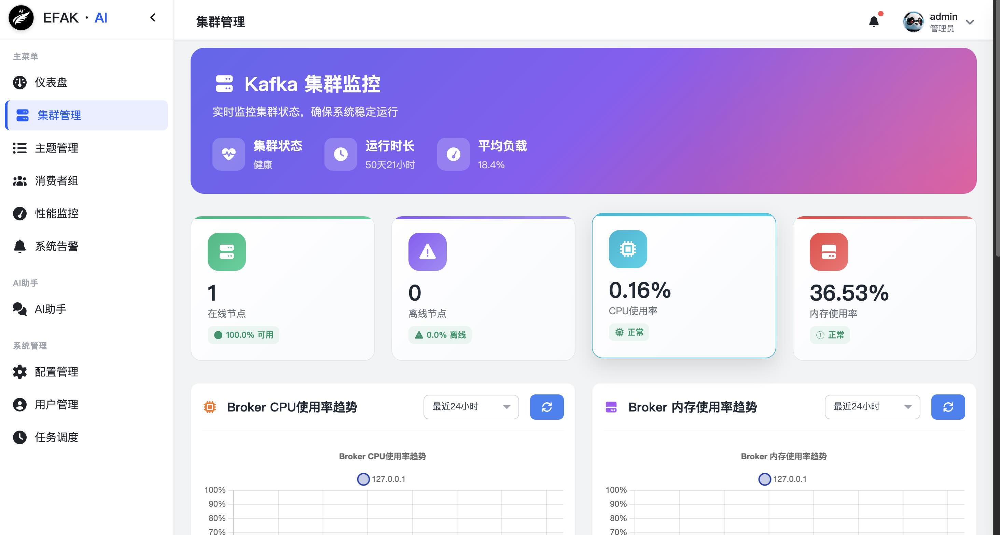

**功能特性：**
- 多集群管理: 支持管理多个 Kafka 集群
- Broker 详情: 查看每个 Broker 的详细信息
- 性能监控: 实时 Broker CPU、内存、磁盘使用率
- 配置管理: 查看和修改集群配置
- 健康检查: 自动检测 Broker 健康状态

**支持的操作：**
- 添加/删除集群配置
- 查看 Broker 列表和状态
- 监控 Broker 性能指标
- 查看 Controller 信息
- 集群元数据查询

---

### 3. 主题管理 (Topics)

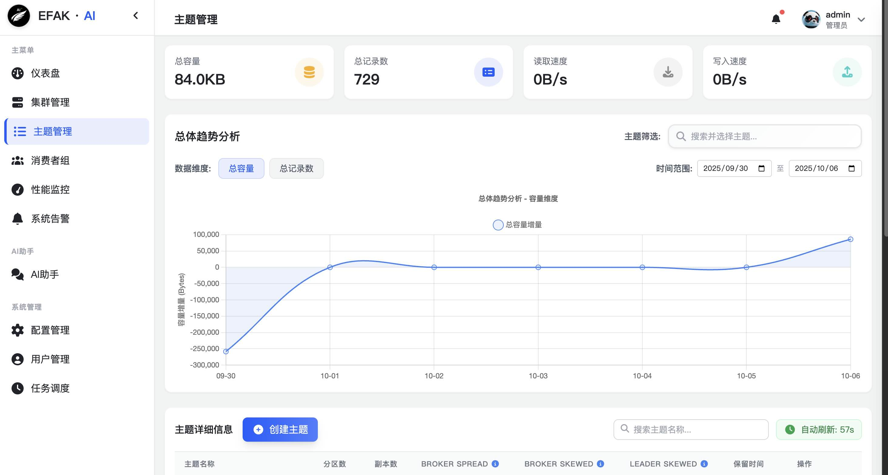

**功能特性：**
- Topic 列表: 展示所有 Topic 及其关键信息
- 高级搜索: 支持按名称、分区数、副本数搜索
- 统计信息: 消息数量、存储大小、消费者组数
- 创建 Topic: 可视化创建 Topic 界面
- 删除 Topic: 安全删除 Topic（带确认）
- 批量操作: 支持批量删除、修改配置

**显示字段：**
- Topic 名称
- 分区数量
- 副本因子
- 消息总数
- 存储大小
- 消费者组数量
- 创建时间
- 操作按钮

---

### 4. 主题详情 (Topic Detail)

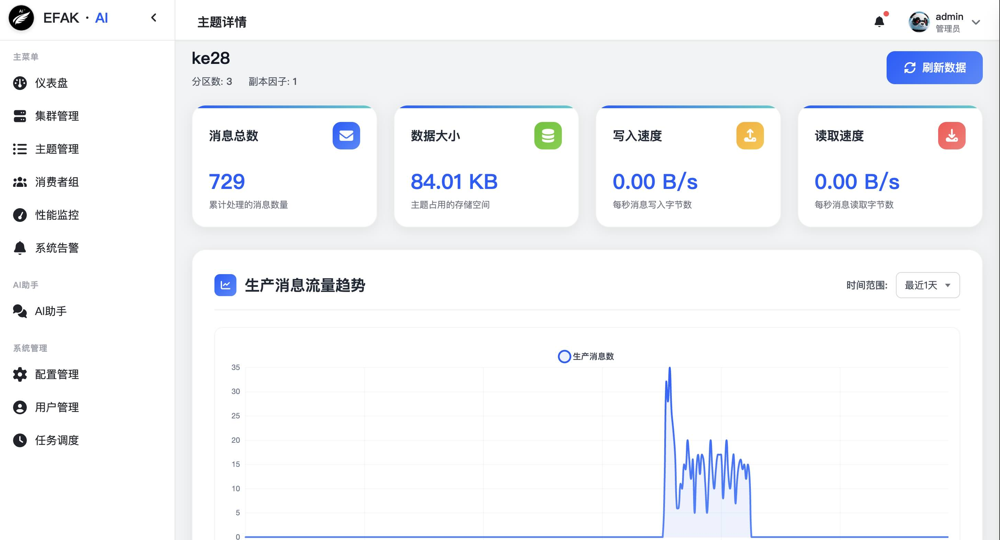

**功能特性：**
- 分区详情: 每个分区的 Offset、Leader、Replicas
- 消息流量: 实时消息生产和消费速率
- 消息查询: 按 Offset、时间戳、Key 查询消息
- 配置管理: 查看和修改 Topic 配置
- 分区重分配: 手动触发分区重新分配
- 消费延迟: 各消费者组的消费进度和延迟

**详细信息：**
- 分区分布和状态
- ISR (In-Sync Replicas) 列表
- Leader 选举历史
- 消息保留策略
- 压缩类型和配置
- 消费者组订阅情况

---

### 5. 消费者监控 (Consumer)

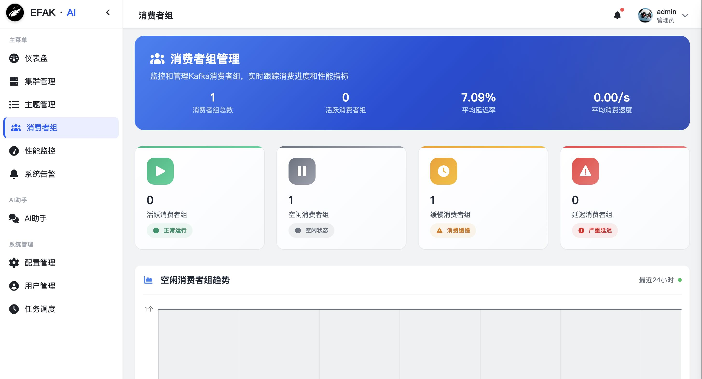

**功能特性：**
- 消费者组列表: 所有活跃的消费者组
- 消费进度: 每个组的消费 Offset 和 Lag
- 延迟告警: 消费延迟超过阈值自动告警
- 消费者详情: 查看组内每个消费者实例
- 消费趋势: 消费速率和延迟趋势图
- 重置 Offset: 支持重置消费位置

**监控指标：**
- Consumer Group ID
- 订阅的 Topic 列表
- 总 Lag 数量
- 消费速率 (msg/s)
- 消费者实例数
- 最后消费时间
- 分区分配策略

---

### 6. AI 智能对话 (AI Chat)

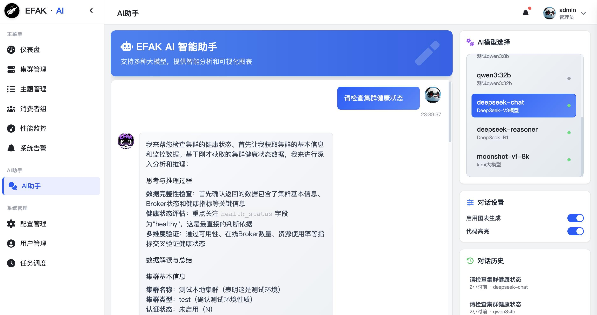

**功能特性：**
- 智能助手: 基于大语言模型的 Kafka 运维助手
- 自然语言交互: 用自然语言查询 Kafka 状态
- 数据可视化: 自动生成图表展示数据
- 问题诊断: 智能分析和解决 Kafka 问题
- 操作建议: 提供最佳实践和优化建议
- 历史记录: 保存对话历史便于回溯

**支持的查询类型：**
- "查询集群状态"
- "分析 Topic XYZ 的消费延迟"
- "为什么消费者组 ABC 停止消费？"
- "如何优化 Topic 性能？"
- "生成消息流量趋势图"
- "诊断 Broker 性能问题"

**AI 能力：**
- 自动理解用户意图
- 查询 Kafka 元数据和指标
- 生成可视化图表 (Chart.js)
- 提供运维建议和最佳实践
- 解释 Kafka 概念和参数

---

### 7. 模型配置 (Model)

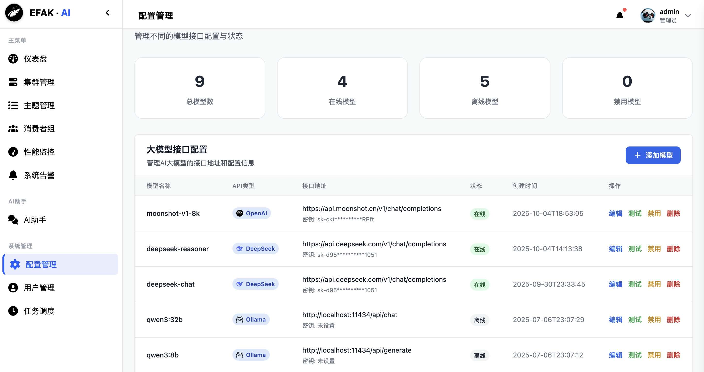

**功能特性：**
- 模型管理: 配置和切换 AI 大语言模型
- API 配置: 管理 OpenAI、Azure、本地模型 API Key
- 参数调优: 调整 Temperature、Max Tokens 等参数
- 模型测试: 在线测试模型响应效果
- 使用统计: 查看 API 调用次数和费用
- 多模型支持: 支持 OpenAI GPT、Azure OpenAI、本地模型

**支持的模型：**
- OpenAI GPT-5 模型
- Azure OpenAI Service
- 本地部署的开源模型 (如 Llama, ChatGLM)
- 自定义模型接口

**配置项：**
- 模型名称和版本
- API Endpoint
- API Key / Token
- Temperature (0.0 - 1.0)
- Max Tokens
- 超时设置
- 重试策略

---

### 8. 性能监控 (Performance)

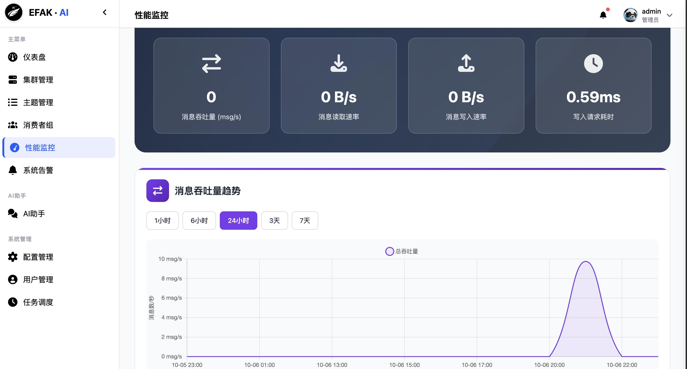

**功能特性：**
- 实时监控: Broker、Topic、Consumer 性能指标
- 历史数据: 支持查询历史性能数据
- 自定义图表: 自定义监控指标和时间范围
- 性能分析: 自动分析性能瓶颈
- 趋势预测: 基于历史数据预测趋势
- 性能告警: 指标超过阈值自动告警

**监控指标：**
- **Broker 指标**:
  - CPU、内存、磁盘使用率
  - 网络 I/O 吞吐量
  - 请求处理延迟
  - 活跃连接数

- **Topic 指标**:
  - 消息生产速率
  - 消息消费速率
  - 字节流入/流出速率
  - 分区 Leader 分布

- **Consumer 指标**:
  - 消费延迟 (Lag)
  - 消费速率
  - 提交频率
  - 重平衡次数

---

### 9. 告警管理 (Alert)

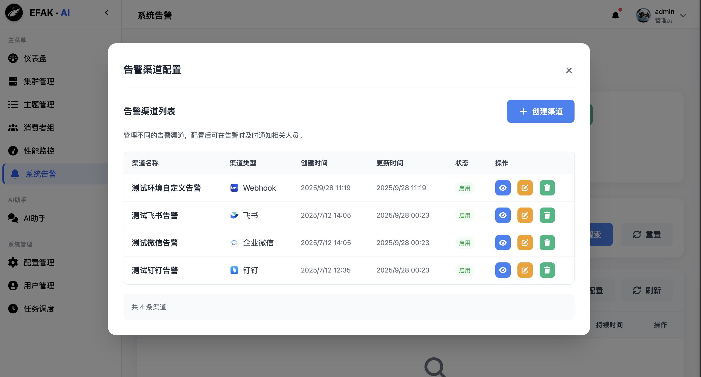

**功能特性：**
- 告警规则: 自定义告警规则和阈值
- 多渠道通知: 支持钉钉、微信、飞书、Webhook
- 告警统计: 告警历史和趋势分析
- 告警静默: 临时屏蔽特定告警
- 智能告警: AI 分析告警原因和建议
- 告警模板: 预定义常用告警规则

**告警类型：**
- **Broker 告警**:
  - Broker 下线
  - CPU/内存/磁盘使用率过高
  - 网络异常

- **Topic 告警**:
  - 分区 ISR 不足
  - 消息积压
  - 副本同步延迟

- **Consumer 告警**:
  - 消费延迟过高
  - 消费者组下线
  - 消费停滞

**通知渠道配置：**
- 钉钉: Webhook URL
- 微信: Webhook URL
- 飞书: Webhook URL
- Webhook: 自定义 HTTP 回调

---

### 10. 任务调度 (Task)

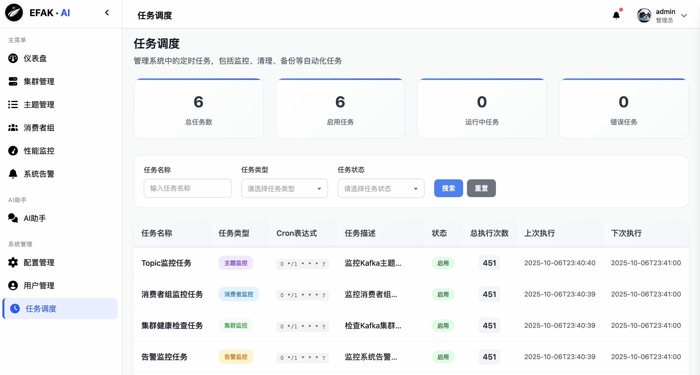

**功能特性：**
- 定时任务: 创建和管理定时任务
- Cron 表达式: 支持复杂的调度规则
- 任务类型: 数据采集、清理、备份、分析
- 执行历史: 查看任务执行记录和结果
- 失败重试: 自动重试失败的任务
- 任务日志: 详细的执行日志

**支持的任务类型：**
- **数据采集任务**:
  - Kafka 指标采集
  - JMX 数据采集
  - 日志收集

- **清理任务**:
  - 过期数据清理
  - 日志归档
  - 临时文件清理

- **备份任务**:
  - 配置备份
  - 元数据导出
  - 数据快照

- **分析任务**:
  - 性能报告生成
  - 趋势分析
  - 异常检测

**调度配置：**
- Cron 表达式编辑器
- 执行时间设置
- 并发控制
- 超时设置
- 失败重试策略

---

### 11. 用户管理 (Users)

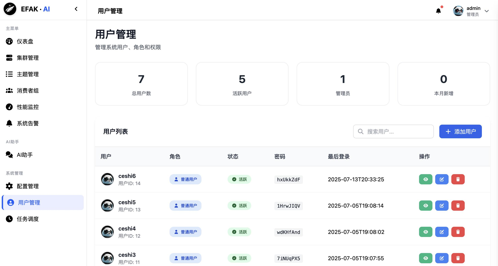

**功能特性：**
- 用户管理: 创建、编辑、删除用户
- 权限控制: 基于角色的访问控制 (RBAC)
- 密码策略: 强制密码复杂度和定期更换

**角色和权限：**
- **超级管理员**:
  - 所有权限
  - 用户管理
  - 系统配置

- **管理员**:
  - 集群管理
  - Topic 管理
  - 告警配置

- **运维人员**:
  - 监控查看
  - 告警处理
  - 任务管理

- **只读用户**:
  - 查看监控数据
  - 查看告警信息
  - 无修改权限

**用户字段：**
- 用户名
- 角色
- 状态 (启用/禁用)
- 最后登录时间
- 创建时间

---

### 12. 多集群管理 (Manager)

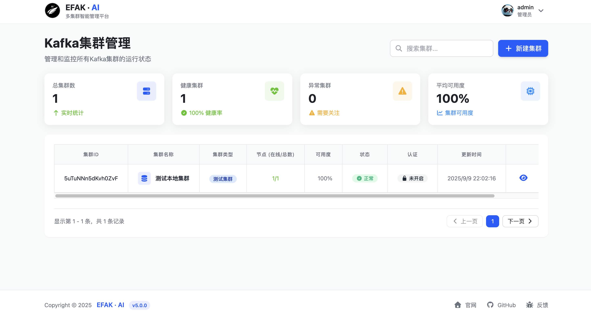

**功能特性：**
- 多集群统一管理: 在一个平台管理多个 Kafka 集群
- 环境隔离: 支持测试、预发、生产等不同环境的集群管理
- 集群切换: 快速在不同集群间切换查看和操作
- 集群对比: 对比不同集群的配置和性能指标

**多环境集群管理：**
- **生产环境 (Production)**:
  - 高可用配置
  - 严格的权限控制
  - 完整的审计日志
  - 实时性能监控
  - 7×24 告警响应

- **预发环境 (Staging)**:
  - 与生产环境配置一致
  - 用于上线前验证
  - 支持压力测试
  - 数据脱敏处理

- **测试环境 (Testing)**:
  - 开发团队使用
  - 支持快速创建/删除 Topic
  - 灵活的配置调整
  - 数据自动清理

- **开发环境 (Development)**:
  - 本地开发调试
  - 无告警限制
  - 支持实验性功能

**集群配置管理：**
- **连接配置**:
  - Broker 地址列表
  - Zookeeper 地址（如使用）
  - SASL/SSL 认证配置
  - 超时和重试参数

- **环境标识**:
  - 集群名称
  - 环境标签 (dev/test/staging/prod)
  - 颜色标识（防止误操作）
  - 备注说明

- **访问控制**:
  - 基于角色的集群访问权限
  - 生产集群限制高危操作
  - 操作审批流程（生产环境）

**集群状态监控：**
- 集群在线状态
- Broker 总数和存活数
- Topic 和分区统计
- 消费者组数量
- 消息吞吐量
- 存储使用情况
- 连接健康度

---

### 部署方式
- Docker: 一键部署，开箱即用
- tar.gz: 传统部署，灵活可控

---

## 相关文档

- [快速开始](../../../../../README.md)
- [部署指南](DEPLOY.md)

---

## 链接

- **GitHub**: [https://github.com/smartloli/EFAK-AI](https://github.com/smartloli/EFAK-AI)
- **官方网站**: [https://www.kafka-eagle.org](https://www.kafka-eagle.org)
- **文档**: [https://docs.kafka-eagle.org](https://docs.kafka-eagle.org)
- **问题反馈**: [GitHub Issues](https://github.com/smartloli/EFAK-AI/issues)

---

## 支持与联系

- **作者**: Mr.SmartLoli
- **邮箱**: smartloli.org@gmail.com
- **版本**: 5.0.0
- **更新日期**: 2025-10-06

---

**© 2025 EFAK-AI. All Rights Reserved.**
